# Setting up PcapDB in Docker

This guide picks up after the completion the ```docker build``` and ```docker run``` commands from the `Readme` in the docker directory.

You can confirm that your docker image is running with the ```docker ps``` command.

## Connect to Docker container with interactive terminal

    docker exec -it pcapdb bash

## Initial user setup
You will have to have a mail server set up in order to create the initial system user.

Next you will need to create your administrative account (can be set to any name, here it is set to ```admin```):

    email=you@example.com
    docker exec pcapdb sudo -u capture bin/python core/manage.py add_user admin Adam Inistrator $email

Response is:

    $ docker exec pcapdb sudo -u capture bin/python core/manage.py add_user admin Adam Inistrator $email
    New user 'admin' created.
    Admin group 'pcapdb_admin' does not exist. Creating it.
    User added to 'pcapdb_admin' group.

An email is generated and sent to the email you specified.

     To set/reset your password, go to https://91e49e2aaf4a/pcapdb/conf/reset/05334536975d4976eef914bec1bb9966.

For the docker images, we had to replace the Docker hostname (here ```91e49e2aaf4a```)

 with the actual URL of the host that the Docker container is residing on.

    https://your.hostname:port/pcapdb/conf/reset/05334536975d4976eef914bec1bb9966

Due to the self-signed SSL certificate, the web browser may give you an error. Click through that to accept and visit the site.  
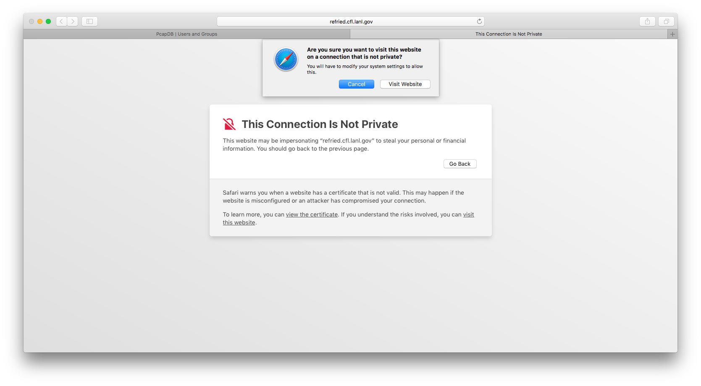

Set your password for your newly created user.
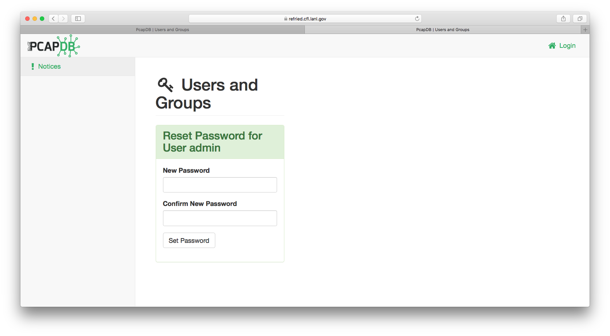

Now you can login with your newly set up account.
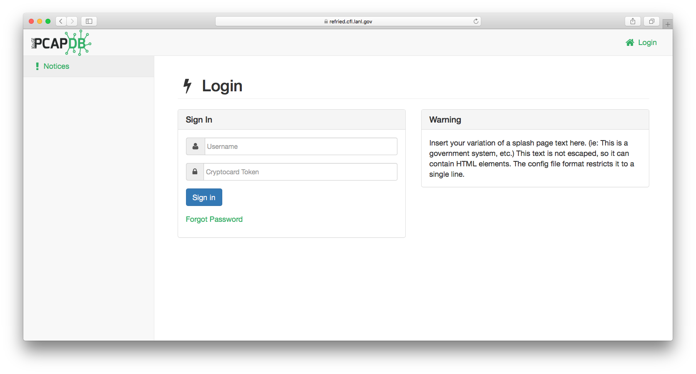

You will see an un-populated Dashboard.
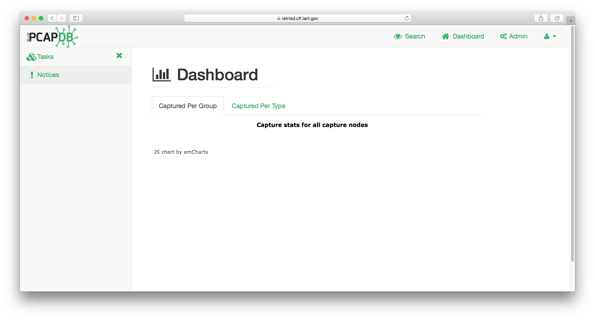

## Setting up a Capture Site

Clicking on the ```Admin``` tab at the top, select ```Capture Sites```.
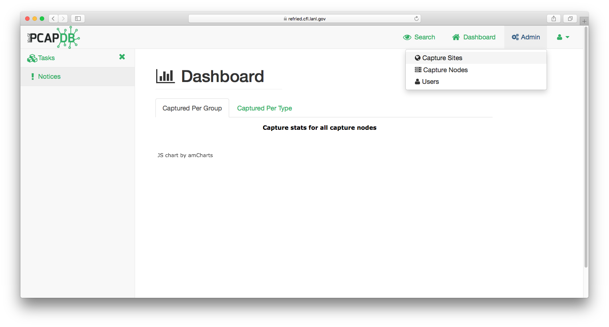

Enter in your values in the ```Create a Capture Site``` boxes towards the left.
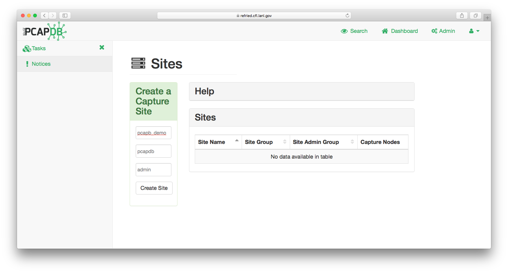

Now that a new site has been created, you will need to add your administrative user to the newed created ```Admin Group``` to have the permissions to proceed. Under the ```Admin``` tab, select ```Users```.
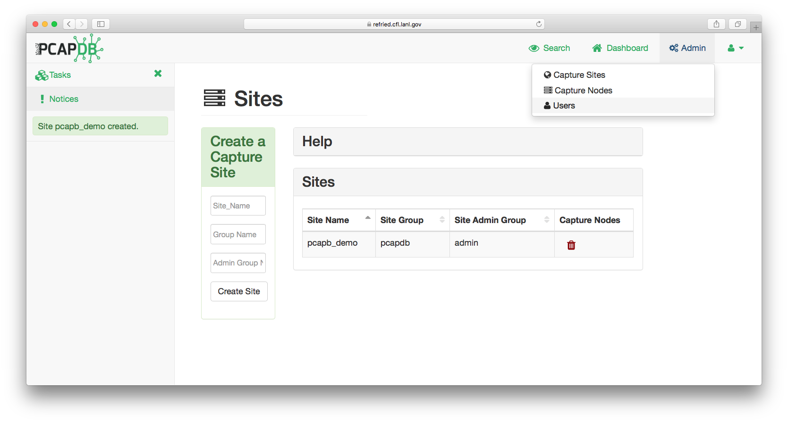

Select your user(s), and click on ```Add to Group```. Select the correct admin group from the dropdown menu. This should be the ```admin``` group created under the previous step.
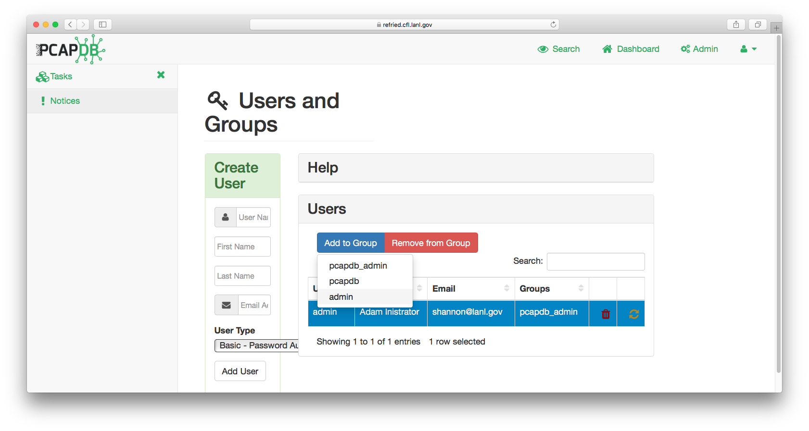

The Groups information will update when they are added.

*You can also create new users through this interface, selecting the login type from ```Basic - Password Auth``` or ```Script - Token Auth```.*
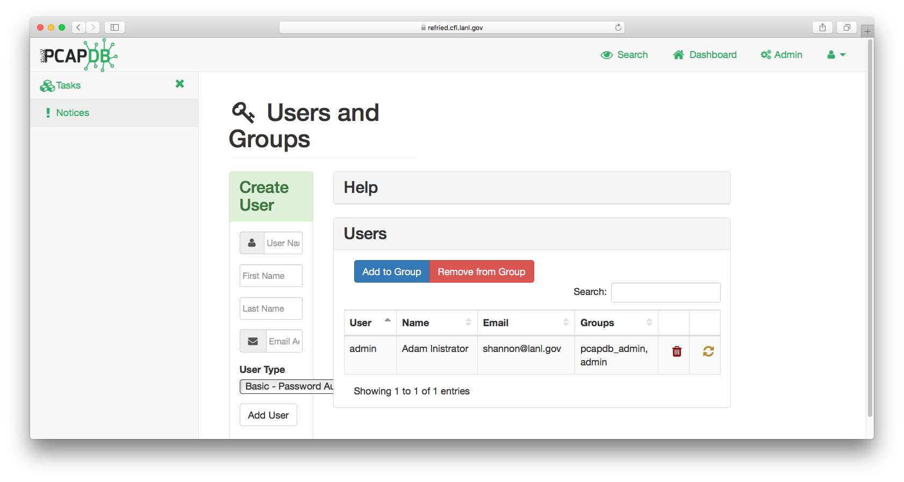

## Setting up a Capture Node

Click on the ```Admin``` tab and select ```Capture Nodes```.
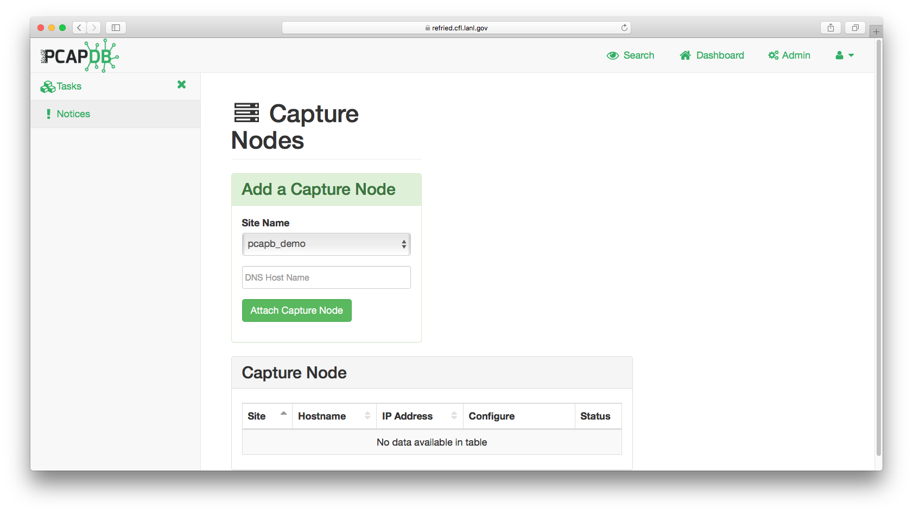

Under the DNS Host Name, this is asking what the Docker container thinks its hostname is.

You can look at the email link received when setting up the initial admin account, or you can run the command and use the ```hostname``` command results.

    docker exec pcapdb hostname

In this instance, it returns

    91e49e2aaf4a

Click on the ```Attach Capture Node``` button.

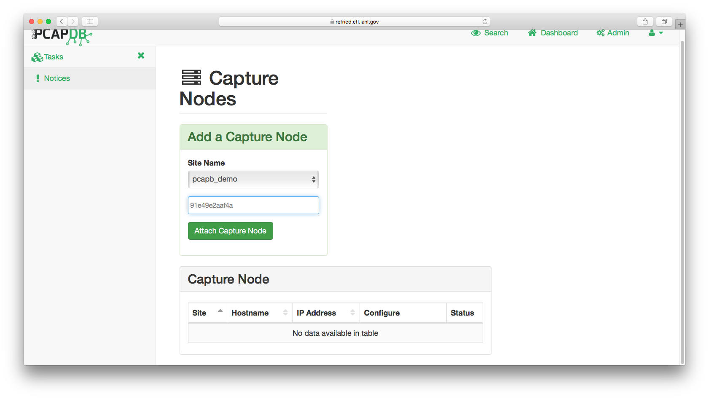

One added, you will have two buttons appear, ```Disks``` and ```Capture```.
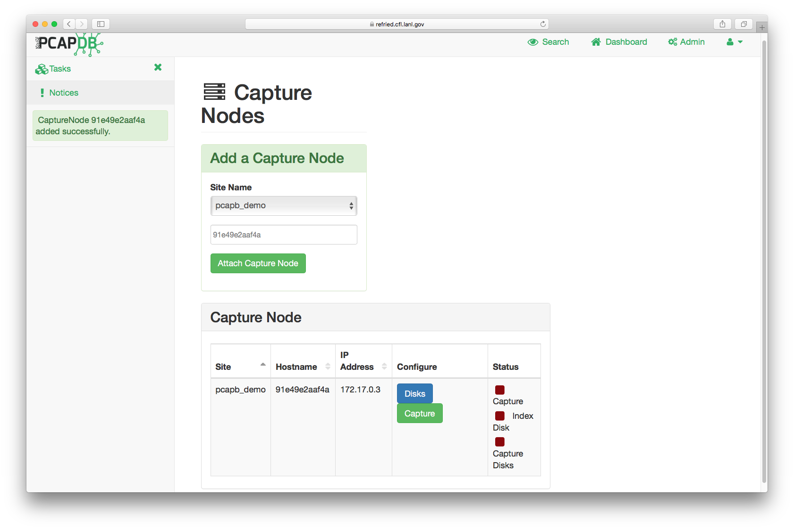

## Setting up Capture Disks

Click on the ```Disks``` button. This will take to you the ```Capture Disks``` screen.
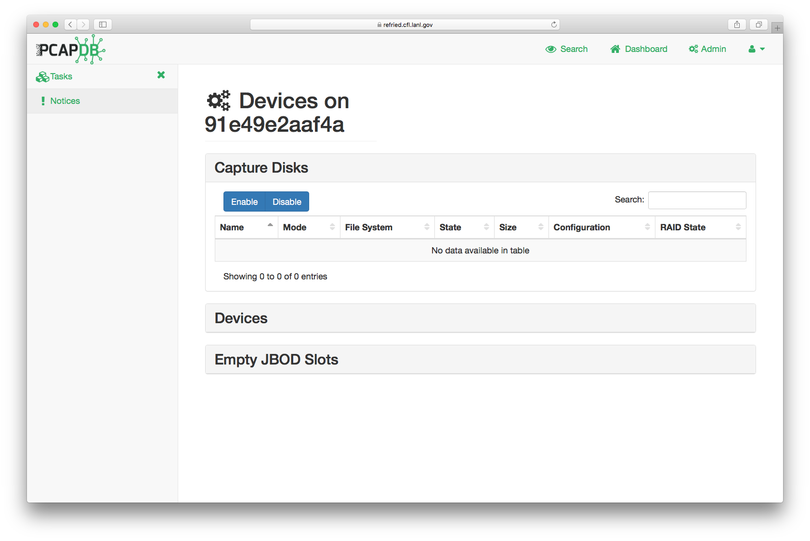

Click on ```Devices``` to view the list of available block devices.
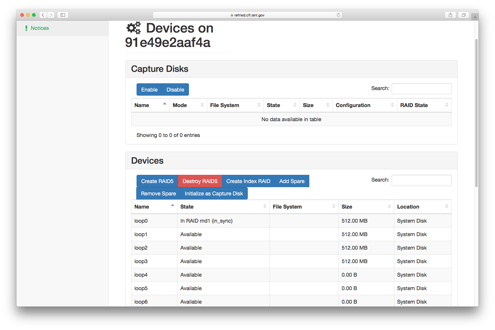

### Setting up the Index RAID

The index disk will expect to create its own RAID array. The Capture Disk can be passed a pre-configured RAID array, or can create a RAID5. *There are some functionality issues between the web interface and the backend for RAID5 that need to be addressed.*
In Docker, the index disk has to be set up to emulate a RAID1 with a loopback.

Select a row under the Devices table for your Index RAID, and click on ```Create Index RAID```.

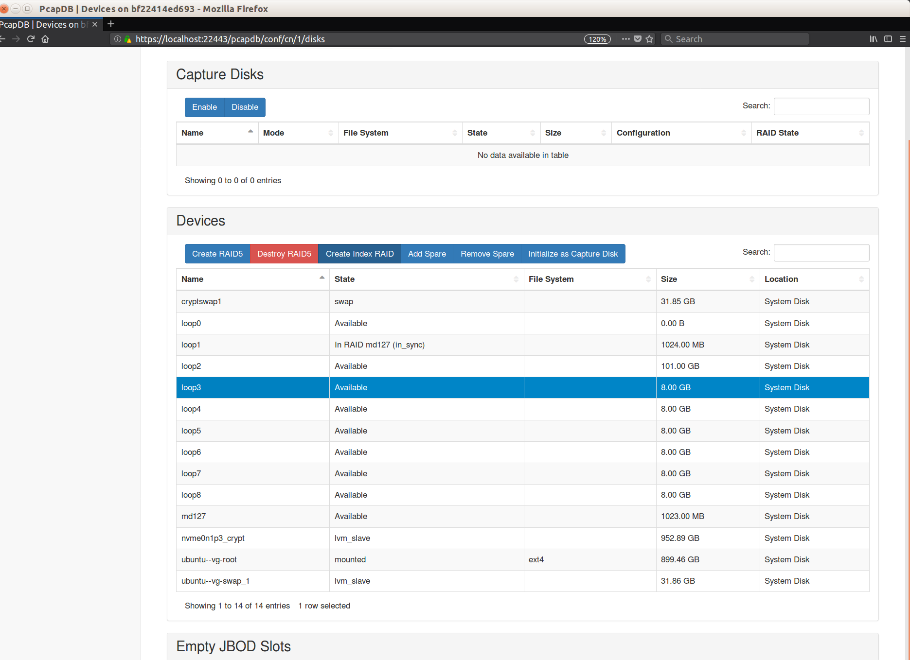

#### Restarting the container / PcapDB setup in Docker

When tearing down a container and re-initializing it, the emulated RAID1 index disk will need to be manually stopped. *X* needs to be replaced with the number device setup specific to your system (such as `/dev/md0`)

    mdadm --stop /dev/mdX
    mdadm --remove /dev/mdX
    mdamd --zero /dev/loopX

### Capture Disk Init

Under Devices, select the device you will set as your Capture Disk and click the button ```Initialize as Capture Disk```.
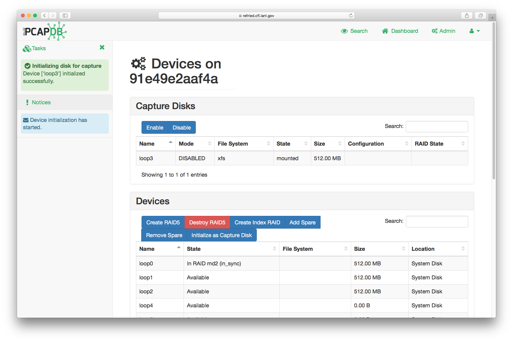

Select row under the Capture Disks, and click the ```Enable``` button to switch it from DISABLED to ACTIVE.
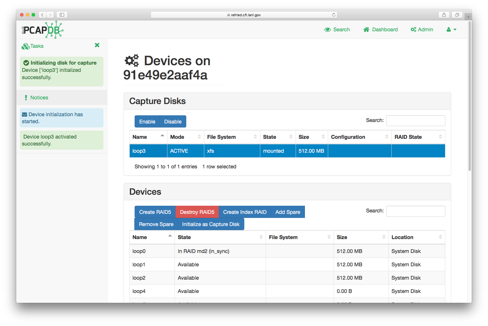

[//]: # (comment)

cd var/pcapdb

    cd /var/pcapdb; bin/capture -m 80 -r -i /src/indexer/tests/data/many_sessions.pcap
